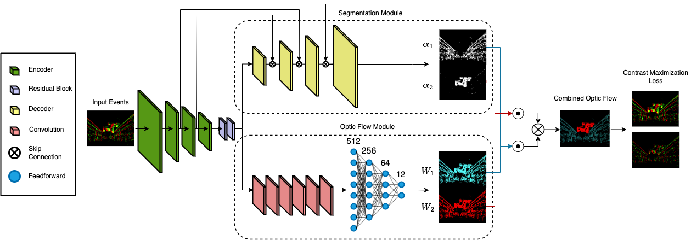

# EV-LayerSegNet: Self-supervised Motion Segmentation using Event Cameras

Repository inspired from [event_flow](https://github.com/tudelft/event_flow)
Scientific Paper: [here](https://drive.google.com/file/d/1DzfJf9MdrnNPFfW4VKw7VO4M3yNSfLif/view?usp=drive_link).

If you use this code, please cite our work:

```bibtex
@unpublished{farahparedesetal2023,
  title={EV-LayerSegNet: Self-supervised Motion Segmentation using Event Cameras},
  author={Farah, Youssef and Paredes-Vall\'es, Federico and de Croon, Guido},
  year={2023}
}
```

This code allows for the reproduction of the experiments leading to the results in Section 5.

<!-- &nbsp; -->

<!-- &nbsp; -->

#

## Usage

This project uses Python >= 3.7.3 and we strongly recommend the use of virtual environments. If you don't have an environment manager yet, we recommend `pyenv`. It can be installed via:

```
curl https://pyenv.run | bash
```

Make sure your `~/.bashrc` file contains the following:

```
export PATH="$HOME/.pyenv/bin:$PATH"
eval "$(pyenv init -)"
eval "$(pyenv virtualenv-init -)"
```

After that, restart your terminal and run:

```
pyenv update
```

To set up your environment with `pyenv` first install the required python distribution and make sure the installation is successful (i.e., no errors nor warnings):

```
pyenv install -v 3.7.3
```

Once this is done, set up the environment and install the required libraries:

```
pyenv virtualenv 3.7.3 event_flow
pyenv activate event_flow

pip install --upgrade pip==20.0.2

cd event_flow/
pip install -r requirements.txt
```

### Download datasets

In this work, we use our dataset generated with ESIM:
- `event_segmentation/datasets/AffineObjects`: [AffineObjects Datasets](https://drive.google.com/file/d/1MH-KOxXU2LM5bE_mknPszNRjoijEVRhj/view?usp=sharing)


These datasets can be downloaded in the expected HDF5 data format and they should be placed in `event_segmentation/datasets/` (as shown above). 

Download size: 2.4 GB. Uncompressed size: 3.6 GB.

Details about the structure of these files can be found in `event_segmentation/datasets/tools/`. 

### Download models

The pretrained models can be downloaded from [here](https://drive.google.com/file/d/1e2qcmpkNTpfGv4ujbE47pk-aD6sQ7Oo6/view?usp=sharing), and are expected at `event_segmentation/mlruns/`. 

In this project we use [MLflow](https://www.mlflow.org/docs/latest/index.html#) to keep track of the experiments. To visualize the models that are available, alongside other useful details, run the following from the home directory of the project:

```
mlflow ui
```

and access [http://127.0.0.1:5000](http://127.0.0.1:5000) from your browser of choice.

## Test

To test EV-LayerSegNet on the test subset of AffineObjects, run:

```
python eval_flow.py <runid> --config configs/eval.yml
```

where `<model_name>` is the name of MLflow run to be evaluated. Note that, if a run does not have a name (this would be the case for your own trained models), you can test it through its run ID (also visible through MLflow).


In `configs/`, you can find the configuration files associated to these scripts and vary the test settings (e.g., number of input events, activate/deactivate visualization).

## Training

Run:

```
python train_flow.py --config configs/train.yml
```
 

**Note that we used a batch size of 8 in our experiments. Depending on your computational resources, you may need to lower this number.**

During and after the training, information about your run can be visualized through MLflow.

## Uninstalling pyenv

Once you finish using our code, you can uninstall `pyenv` from your system by:

1. Removing the `pyenv` configuration lines from your `~/.bashrc`.
2. Removing its root directory. This will delete all Python versions that were installed under the `$HOME/.pyenv/versions/` directory:

```
rm -rf $HOME/.pyenv/
```
